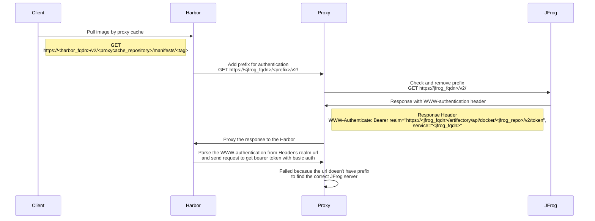

According the RFC https://datatracker.ietf.org/doc/html/rfc6750 and OCI distribution spec, the bearer token is used for authentication and authorization when pulling images.

```mermaid

sequenceDiagram
    participant Client
    participant Harbor
    participant Proxy
    participant JFrog
    Client->>Harbor: Pull image by proxy cache
    Note right of Client: GET<br> https://<harbor_fqdn>/v2/<proxycache_repository>/manifests/<tag>
    Harbor->>Proxy: Add prefix for authentication<br> GET https://<jfrog_fqdn>/<prefix>/v2/
    Proxy->>JFrog: Check and remove prefix <br> GET https://jfrog_fqdn>/v2/
    JFrog->>Proxy: Response with WWW-authentication header
    Note Left of JFrog: Response Header <br> WWW-Authenticate: Bearer realm="https://<jfrog_fqdn>/artifactory/api/docker/<jfrog_repo>/v2/token",<br> service="<jfrog_fqdn>"
    Proxy->>Harbor: Proxy the response to the Harbor 
    Harbor->>Proxy: Parse the WWW-authentication from Header's realm url <br> and send request to get bearer token with basic auth
    Proxy->>Proxy: Failed becasue the url doesn't have prefix <br> to find the correct JFrog server

```